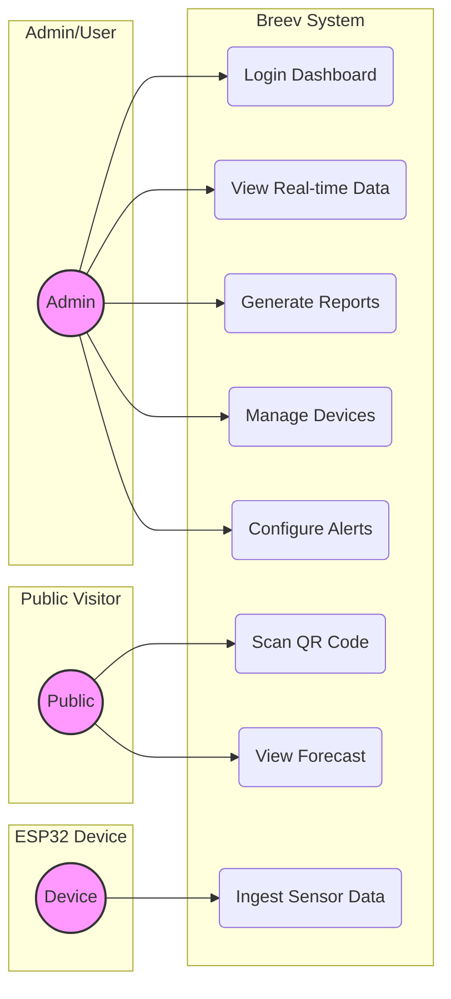
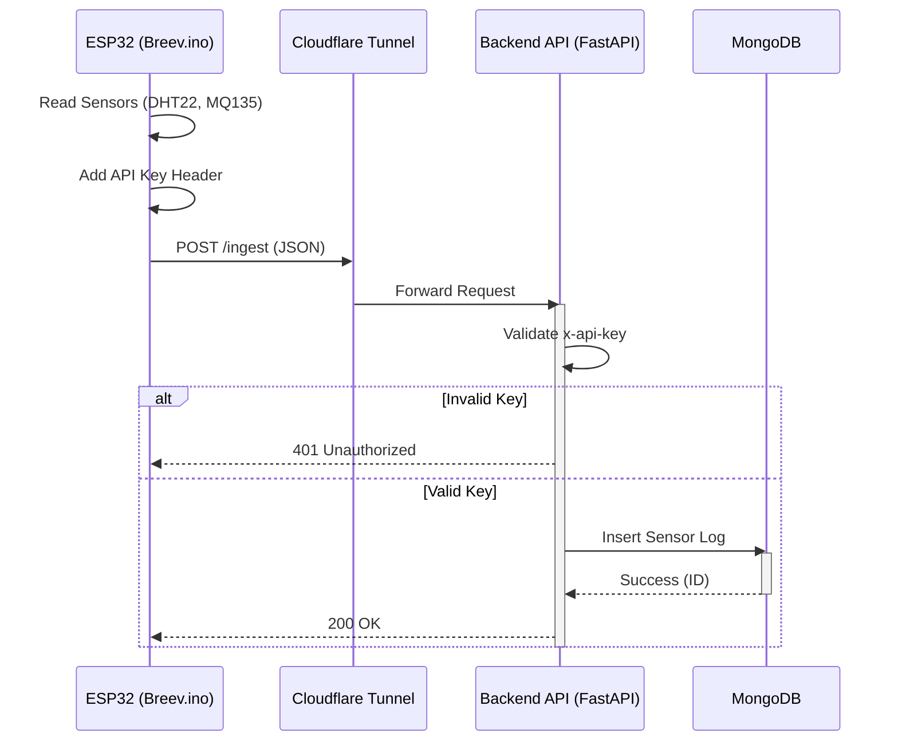
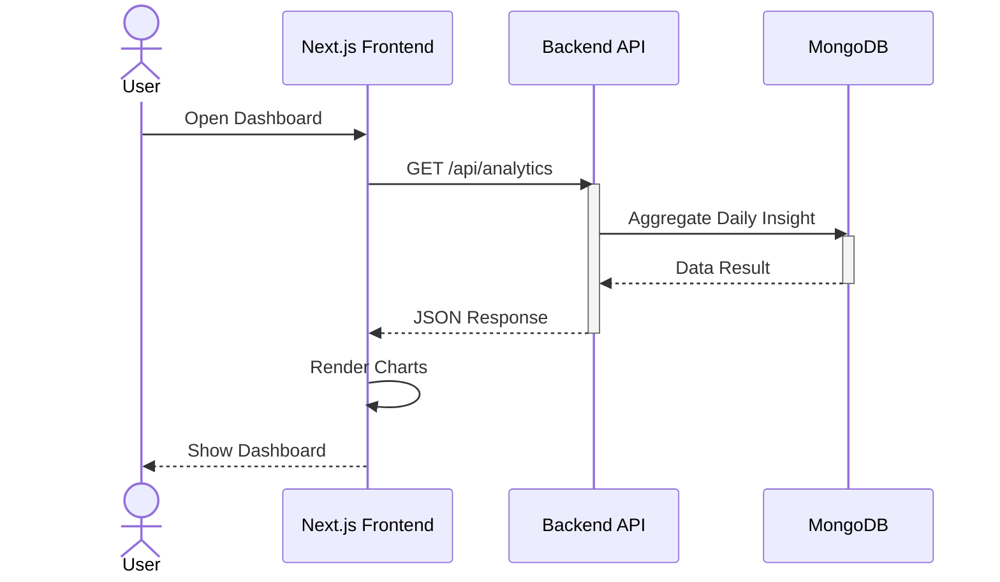
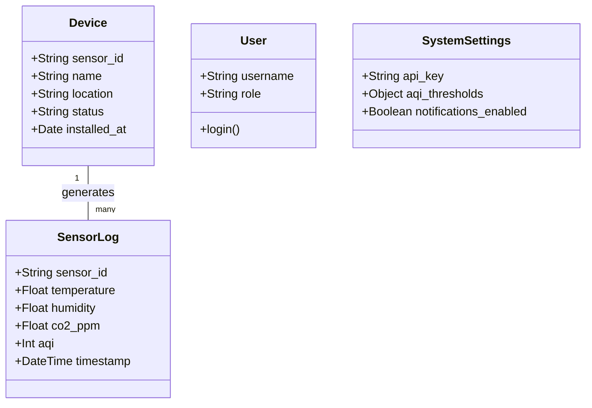

# 📊 Breev UML Diagrams

Dokumentasi diagram UML untuk memahami alur sistem Breev.
Diagram ini ditulis dalam format **PlantUML**. Anda bisa merender-nya menggunakan plugin VS Code atau [PlantText](https://www.planttext.com/).

## 1. Use Case Diagram
Menggambarkan interaksi aktor dengan sistem.

## 2. Sequence Diagram: Data Ingestion
Alur bagaimana data dikirim dari sensor hingga tersimpan.

## 3. Sequence Diagram: User View Dashboard
Alur user melihat data di frontend.

## 4. Class Diagram
Struktur data utama dalam sistem.

